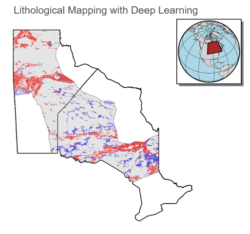
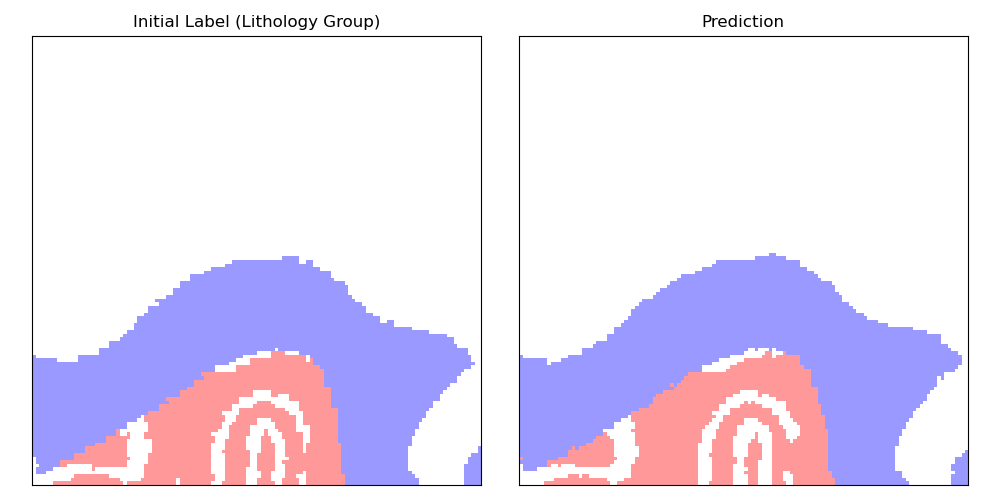
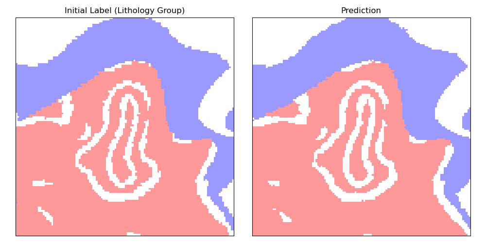

# GeoFormer

**Predictive Lithological Mapping and Uncertainty Quantification with Deep Learning**

<p align="center">
  
</p>

<p align="center"><em>Applications in the Hudson Bay Lowland and Southwestern Manitoba</em></p>

---

## 🔧 Installation

To install GeoFormer, follow the steps below:

```bash
git clone https://github.com/Liang-Ding/geoformer.git
cd geoformer
pip install -e .
```

---

## 🚀 Run Inference with a Pretrained Model

### 1. Download the pretrained model:

You can download the pretrained model from the following link:

👉 [Download Model (Dropbox)](https://www.dropbox.com/scl/fi/o0yedehap1190apyvavfl/mg2l_epoch1000_final_model.pth?rlkey=qowb382w9wa4kkqtgayohac46&st=ypzd405y&dl=0)

Place the downloaded file at:

```bash
~/geoformer/checkpoints/mg2l_epoch1000_final_model.pth
```

### 2. Run the prediction script:

```bash
cd geoformer/geoformer/
python predict.py --config ./configs/config.yaml
```

### 3. Plot and compare the prediction with the initial labels

```bash
python plot_prediction.py
```

---

## 📊 Benchmark Results

The following examples demonstrate the model's prediction performance.  
Each example consists of the ground-truth label (left) and the model prediction (right):

<div align="center">
  
</div>

<div align="center">
  
</div>

---

## 📁 Folder Structure Overview

```plaintext
geoformer/
├── checkpoints/           # Pretrained model parameters
├── docs/                  # Documentation and visualizations
├── examples/benchmark/    # Benchmark results
├── geoformer/             # Source code
    ├──configs/            # Configuration files
    ├──models/             # The Swin Transformer-Based model
    ├──dataloaders/        # The dataloaders
    └── ...
```

---

## 📬 Citation
> L. Ding, G. Bellefleur, O. Boulanger, P. Vo (2025). Supervised Swin Transformer-Based Predictive Lithological Mapping 
> and Uncertainty Quantification Using Aeromagnetic and Gravity Data.  _in preparation_. 
